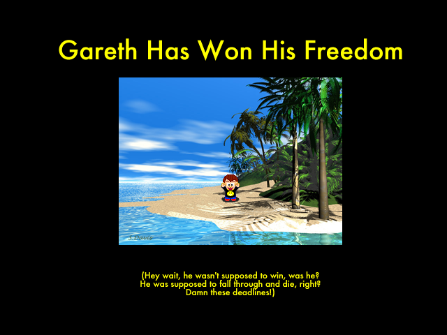

# No Gareth No Port
This is a porting project to bring a great 16 year old game back into the modern era

# Setup

- Install VS Code
- Install Node
- Install the VS Code Extension called "Live Server"
- run `npm install -g typescript`
- cd into the Game folder
- run `tsc -w` to start the TypeScript Compiler
- start the Live Server Extension
  (by clicking the "Go Live" Button on the bottom right of VSCode)
- open a browser to http://localhost:5500

# Thanks Bareth
View latest version here: https://nogarethno.azurewebsites.net/

